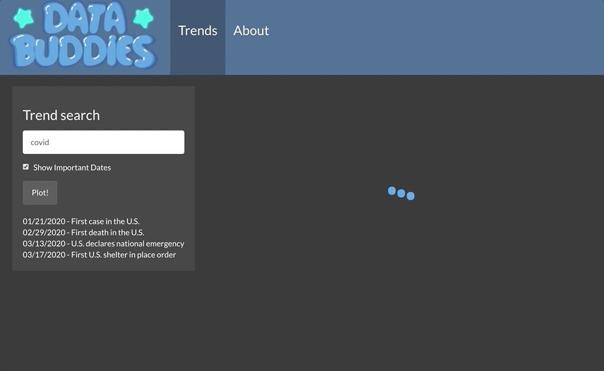

# Data Buddies

## About the Data Buddies
We are a team of fourth year students at Cal Poly San Luis Obispo. Our team consists of statistics major Markelle Kelly, software engineering major Luke Reckard, statistics major Jenna Landy, and statistics major Ashley Jacobson.

## About the App
This app can be used to investigate how social media trends and Google searches have been affected by COVID-19, specifically in the context of the spread of COVID-19 in the U.S. We used the Google trends API and a repository of pre-collected tweets related to COVID to look at these trends from the introduction of COVID-19 to the U.S. on January 21, 2020 to the present.

## How to Use The App
Press the "Plot!" button to start plotting. To add terms to the graph, type it in  the "Trend Search" box and press the "Plot!" button. When no trend search is inputted, the graph will show the Google and Twitter trends for "coronavirus" along with the trend line for number of cases. The "Show Important Dates" checkbox graphs markers for dates that could give context to some of the trends.

## Data Sources
- [Emily Chen's repository of pre-collected tweets related to COVID19](echen102/COVID-19-TweetIDs)
- [COVID-19 Data Repository by the Center for Systems Science and Engineering (CSSE) at Johns Hopkins University](https://github.com/CSSEGISandData/COVID-19): number of daily worldwide cases
- [Google Trends](https://trends.google.com/trends/) via the [gtrendsR package for R](https://www.rdocumentation.org/packages/gtrendsR/versions/1.4.4)